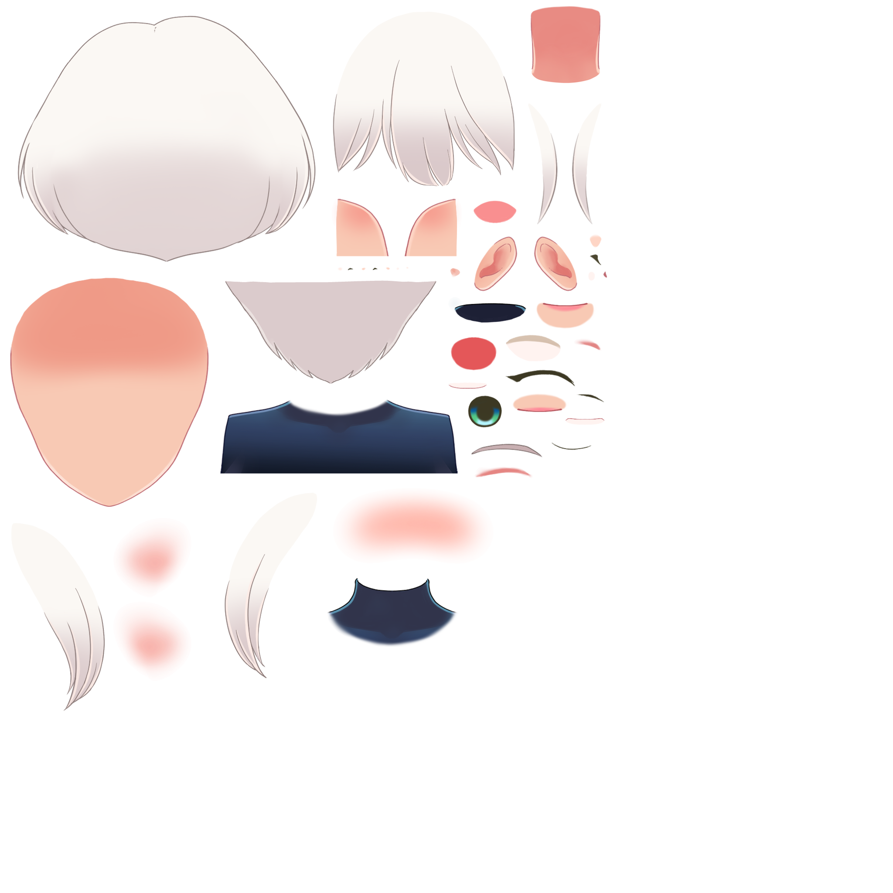
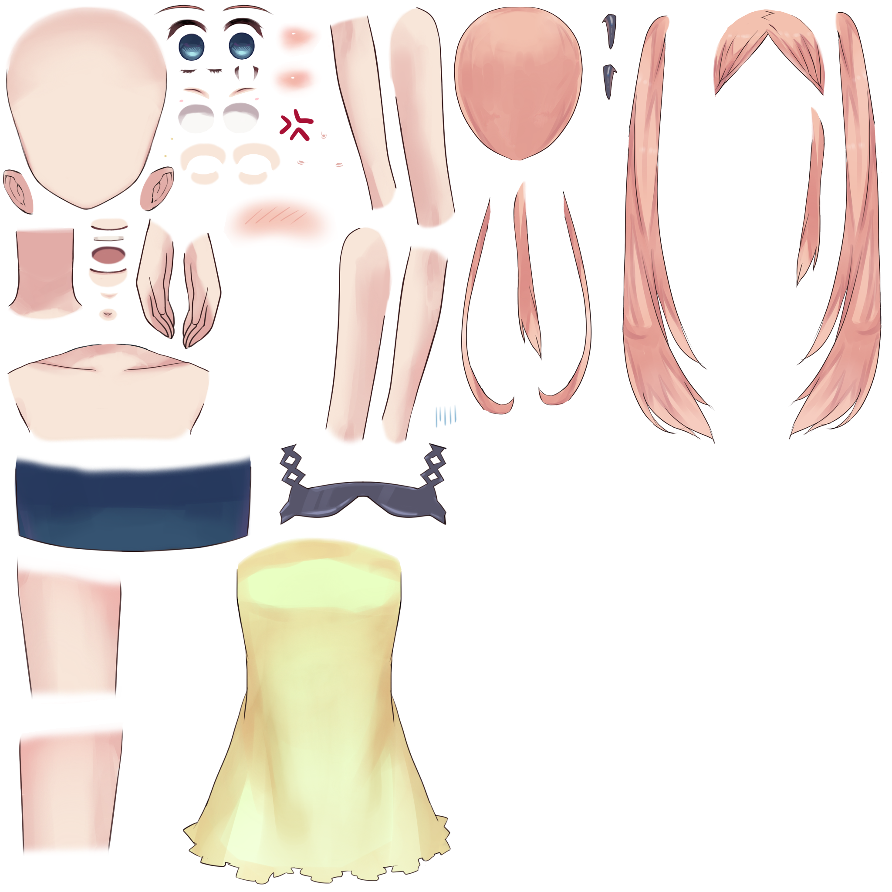
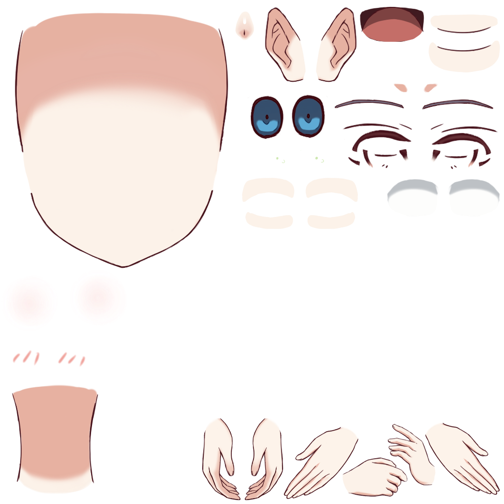
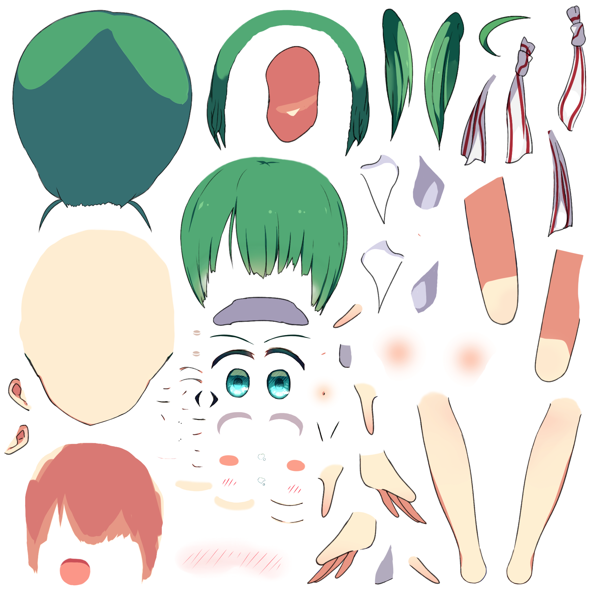
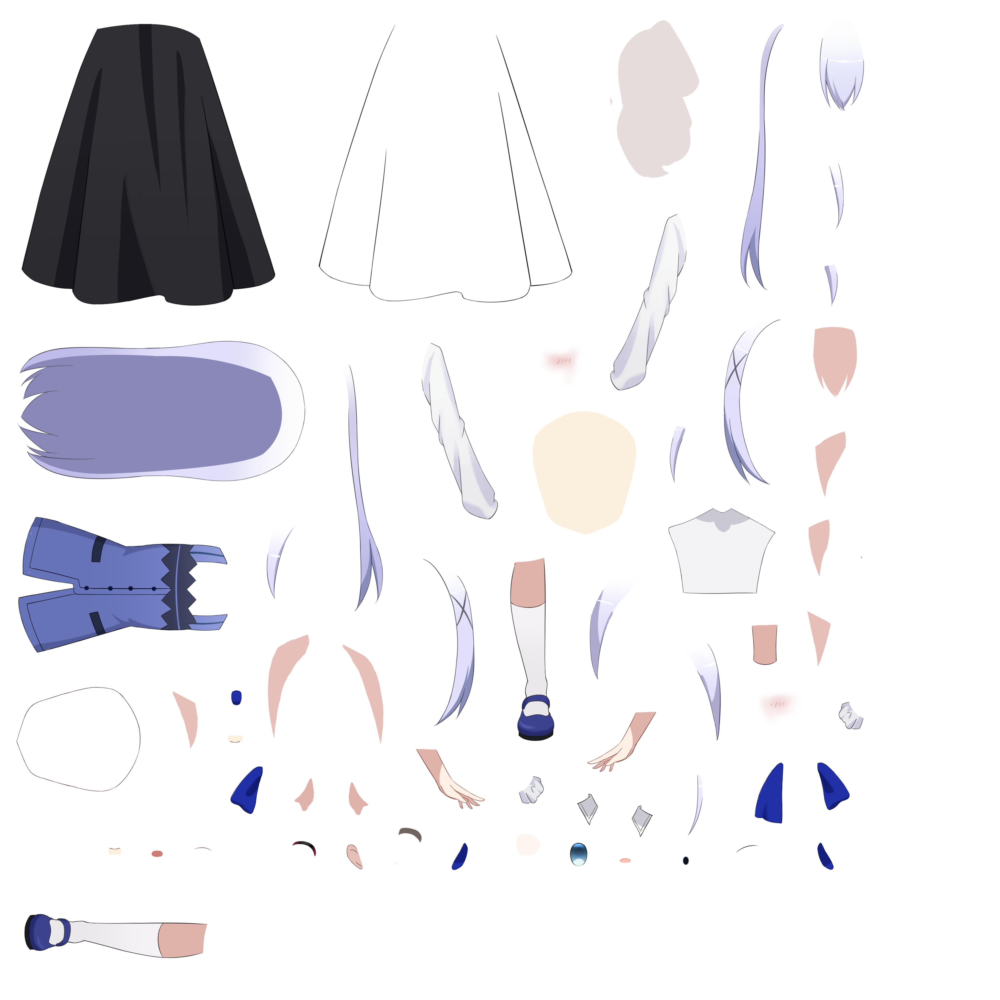

<div align="center">

# 🌸 Alisha AI — KiloClaw Edition

**مساعدة ذكاء اصطناعي ثلاثية الأبعاد تعمل مباشرة في المتصفح**

[](https://magengillan00-lgtm.github.io/Alisha/)
[](https://huggingface.co/spaces/ZeedToven/My-AI-Agent)
[](https://ai.google.dev/)

</div>

---

## 🎭 الأفاتارات المتاحة

<div align="center">
<table>
<tr>
<td align="center">
<br/>
<b>Kei</b><br/>
<sub>Live2D 2D</sub>
</td>
<td align="center">
<br/>
<b>Epsilon</b><br/>
<sub>Live2D 2D</sub>
</td>
<td align="center">
<br/>
<b>Frieren</b><br/>
<sub>Live2D 2D</sub>
</td>
<td align="center">
<br/>
<b>Haru</b><br/>
<sub>Live2D 2D</sub>
</td>
</tr>
<tr>
<td align="center">
<br/>
<b>Tsumiki</b><br/>
<sub>Live2D 2D</sub>
</td>
<td align="center">
<br/>
<b>香風智乃 Chino</b><br/>
<sub>Live2D 2D</sub>
</td>
<td align="center">
<br/>
<b>Waifu</b><br/>
<sub>VRM 3D</sub>
</td>
<td align="center">
🔜<br/>
<b>قريباً</b><br/>
<sub>More Coming</sub>
</td>
</tr>
</table>
</div>

---

## ✨ المميزات

### 🤖 ذكاء اصطناعي متعدد المزودين
| المزود | الموديل | الحالة |
|--------|---------|--------|
| 🟢 HuggingFace Space | Gemini 2.0 Flash | الأساسي |
| 🔵 KiloClaw Backend | Llama 3.3 70B (Groq) | احتياطي |
| 🟡 Groq Direct | Llama 3.3 70B | احتياطي ثانٍ |

### 🎨 الواجهة
- **أفاتارات Live2D** — حركات طبيعية وتحريك شفاه (Lip Sync)
- **أفاتار 3D** (VRM) مع حركات ثلاثية الأبعاد
- **3 خلفيات أنمي:** فضاء 🌌، حديقة سكورا 🌸، غرفة أنمي 🏠
- تصميم زجاجي (Glass Morphism) أنيق

### 🌐 دعم متعدد اللغات
- 🇸🇦 العربية — ردود وصوت عربي كامل
- 🇺🇸 English — English voice & responses
- 🇯🇵 日本語 — 日本語の音声と応答

### 🔊 الصوت
- تحويل نص إلى كلام (TTS) عبر Web Speech API
- اختيار الصوت حسب اللغة
- تحريك شفاه الأفاتار مزامنةً مع الصوت

### ⚙️ الإعدادات
- اختيار الموديل الذكي
- تغيير اللغة والصوت
- تغيير الأفاتار
- تغيير الخلفية
- حفظ الإعدادات تلقائياً

### 🔐 الأمان
- المفاتيح محفوظة كـ **GitHub Secrets** ولا تظهر في الكود
- تُحقن تلقائياً عند النشر عبر **GitHub Actions**
- Backend على خادم آمن (KiloClaw)

---

## 🏗️ البنية التقنية

```
المستخدم (المتصفح)
       │
       ▼
GitHub Pages (index.html)
       │
       ├──▶ HuggingFace Space API (Gemini 2.0 Flash) ← الأساسي
       │         └── GitHub Integration
       │
       ├──▶ KiloClaw Backend (Groq Llama 3.3) ← احتياطي 1
       │
       └──▶ Groq Direct API ← احتياطي 2
```

---

## 🛠️ التقنيات المستخدمة

| التقنية | الاستخدام |
|---------|-----------|
| **Three.js** | رندر الأفاتار 3D |
| **@pixiv/three-vrm** | تحميل نماذج VRM |
| **PIXI.js + pixi-live2d-display** | رندر أفاتارات Live2D |
| **Cubism SDK** | محرك Live2D |
| **Web Speech API** | تحويل نص إلى صوت |
| **Gemini 2.0 Flash** | الذكاء الاصطناعي الأساسي |
| **Groq (Llama 3.3 70B)** | نموذج احتياطي |
| **GitHub Actions** | حقن المفاتيح عند النشر |
| **HuggingFace Spaces** | Backend API |

---

## 📂 هيكل المشروع

```
Alisha/
├── index.html                    # الملف الرئيسي
├── memory.json                   # ذاكرة المحادثة
├── assets/
│   ├── models/
│   │   ├── 2d/                   # أفاتارات Live2D
│   │   │   ├── kei_vowels_pro/
│   │   │   ├── Epsilon_free/
│   │   │   ├── Frieren/
│   │   │   ├── haru/
│   │   │   ├── tsumiki/
│   │   │   └── chino/
│   │   └── 3d/                   # أفاتارات VRM
│   │       ├── waifu.vrm
│   │       ├── animations/       # حركات FBX
│   │       └── backgrounds/      # خلفية HDR
│   ├── audio/
│   └── skills/
├── .github/
│   └── workflows/
│       └── deploy.yml            # GitHub Actions
└── agents/                       # وحدات AI
```

---

## 🚀 التشغيل

الموقع يعمل مباشرة على GitHub Pages — لا يحتاج تثبيت أي شيء.

**أول مرة:**
1. افتح الموقع
2. اختر الموديل الذكي، اللغة، الأفاتار، الخلفية
3. اضغط "تشغيل أليشيا" 🌸

**المرات التالية:** يبدأ تلقائياً بإعداداتك السابقة.

---

## 👨‍💻 المطور

**غيلان بن عقبة** — الملك الأحمر

**الإصدار:** 2.0.0 — KiloClaw Edition  
**آخر تحديث:** 2026-04-18

---

<div align="center">
مبني بـ ❤️ وقوة KiloClaw AI
</div>
