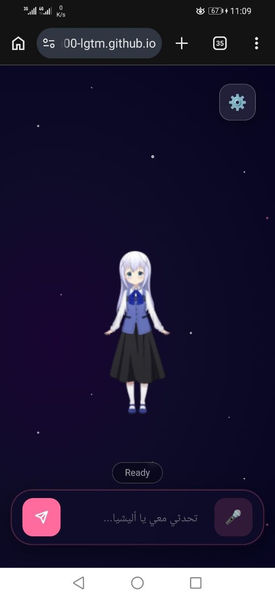

<div align="center">

# 🌸 Alisha AI — KiloClaw Edition

**مساعدة ذكاء اصطناعي ثلاثية الأبعاد تعمل مباشرة في المتصفح**

[](https://magengillan00-lgtm.github.io/Alisha/)
[](https://huggingface.co/spaces/ZeedToven/My-AI-Agent)
[](https://ai.google.dev/)

</div>

---

## 🎭 الأفاتارات المتاحة

<div align="center">

### أفاتارات Live2D (ثنائية الأبعاد)

<table>
<tr>
<td align="center" width="180">
<br/><br/>
<b>🟢 Kei</b><br/>
<sub>شعر أخضر • زي مدرسي</sub>
</td>
<td align="center" width="180">
<br/><br/>
<b>⬜ Epsilon</b><br/>
<sub>شعر أبيض قصير • أنيق</sub>
</td>
<td align="center" width="180">
<br/><br/>
<b>🪄 Frieren</b><br/>
<sub>شعر أبيض • مجوسة</sub>
</td>
</tr>
<tr>
<td align="center" width="180">
<br/><br/>
<b>🌸 Haru</b><br/>
<sub>شعر وردي • فستان أصفر</sub>
</td>
<td align="center" width="180">
<br/><br/>
<b>🎀 Tsumiki</b><br/>
<sub>شعر أسود • فستان أبيض</sub>
</td>
<td align="center" width="180">
<br/><br/>
<b>🐰 香風智乃 Chino</b><br/>
<sub>من أنمي ستيل هاوس</sub>
</td>
</tr>
</table>

### أفاتار VRM (ثلاثي الأبعاد)

<table>
<tr>
<td align="center">
<br/><br/>
<b>🐇 Waifu 3D</b><br/>
<sub>أفاتار VRM • أذنان أرنب • حركات كاملة</sub>
</td>
</tr>
</table>

</div>

---

## ✨ المميزات

### 🤖 ذكاء اصطناعي متعدد المزودين
| المزود | الموديل | الأولوية |
|--------|---------|--------|
| 🟢 **Groq** | Llama 3.3 70B | افتراضي |
| 🔵 **Gemini** | 2.0 Flash (HF Space) | احتياطي |
| 🤖 **KiloClaw** | Backend Server | احتياطي ثانٍ |

> يمكن التبديل بين المزودين من الإعدادات ⚙️

### 🎨 الواجهة
- **أفاتارات Live2D** — حركات طبيعية وتحريك شفاه (Lip Sync)
- **أفاتار 3D (VRM)** — حركات جسم كاملة، تنفس، إيماء عيون
- **3 خلفيات أنمي:** فضاء 🌌، حديقة سكورا 🌸، غرفة أنمي 🏠
- الأفاتار يملأ الشاشة كاملة بدون عوائق
- زر 💬 لإظهار/إخفاء صندوق الكتابة عند الحاجة

### 🌐 دعم متعدد اللغات
- 🇸🇦 العربية — ردود وصوت عربي كامل
- 🇺🇸 English — English voice & responses
- 🇯🇵 日本語 — 日本語の音声と応答

### 🔊 الصوت
- تحويل نص إلى كلام (TTS) عبر Web Speech API
- اختيار الصوت حسب اللغة
- تحريك شفاه الأفاتار مزامنةً مع الصوت

### ⚙️ الإعدادات
- **تبديل مزود AI** — Groq / Gemini / KiloClaw
- اختيار الموديل الذكي
- تغيير اللغة والصوت
- تغيير الأفاتار
- تغيير الخلفية
- حفظ جميع الإعدادات تلقائياً

### 🔐 الأمان
- المفاتيح محفوظة كـ **GitHub Secrets** (لا تظهر في الكود)
- تُحقن تلقائياً عند النشر عبر **GitHub Actions**

---

## 🏗️ البنية التقنية

```
المستخدم (المتصفح)
       │
       ▼
GitHub Pages (index.html)
       │
       ├──▶ Groq API (Llama 3.3 70B) ◀── الافتراضي
       ├──▶ HuggingFace Space (Gemini 2.0 Flash)
       └──▶ KiloClaw Backend (خادم خاص)
```

---

## 🛠️ التقنيات

| التقنية | الاستخدام |
|---------|-----------|
| **Three.js + VRM** | أفاتار 3D |
| **PIXI.js + Live2D** | أفاتارات 2D |
| **Web Speech API** | نص إلى صوت |
| **Gemini 2.0 Flash** | AI عبر HuggingFace |
| **Groq Llama 3.3** | AI مباشر |
| **GitHub Actions** | حقن المفاتيح |

---

## 📂 هيكل المشروع

```
Alisha/
├── index.html
├── assets/
│   ├── models/
│   │   ├── 2d/  (kei, epsilon, frieren, haru, tsumiki, chino)
│   │   └── 3d/  (waifu.vrm, animations/, backgrounds/)
│   └── previews/  (صور الأفاتارات)
└── .github/workflows/deploy.yml
```

---

<div align="center">

**المطور:** غيلان بن عقبة — الملك الأحمر  
**الإصدار:** 2.1.0 — KiloClaw Edition  
**آخر تحديث:** 2026-04-18

مبني بـ ❤️ وقوة KiloClaw AI

</div>
