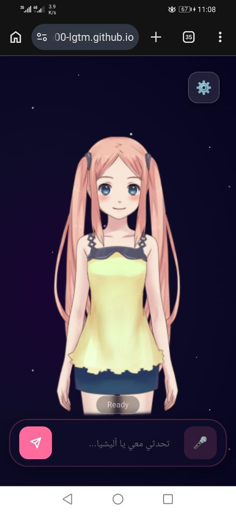
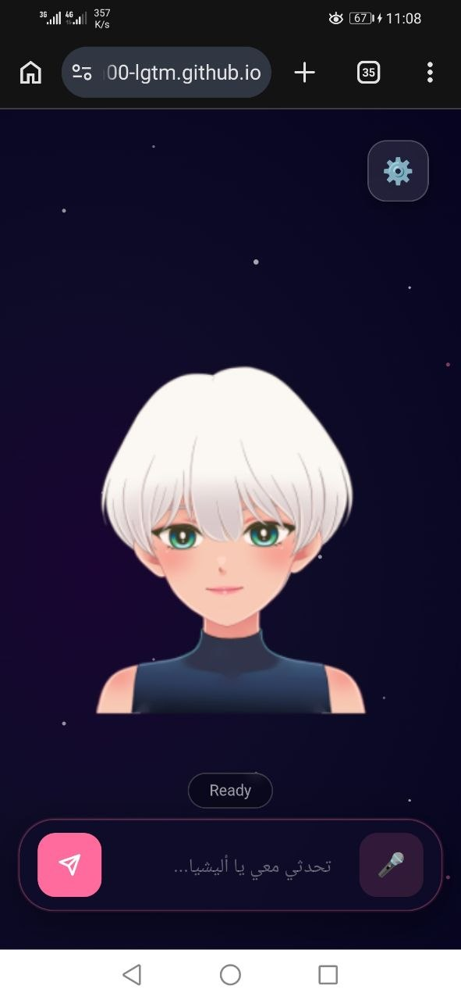
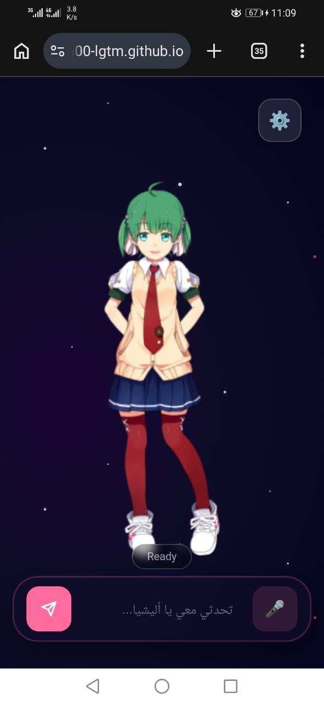
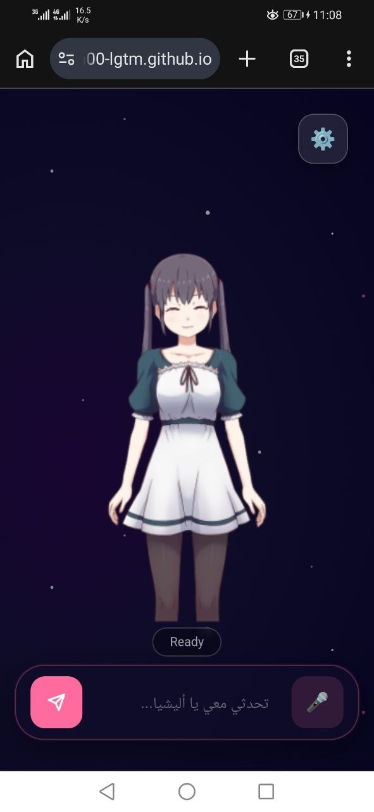
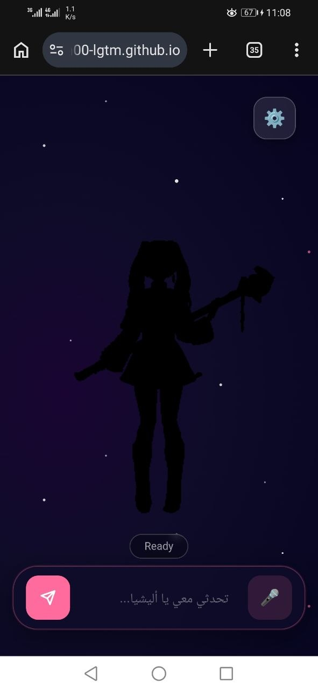
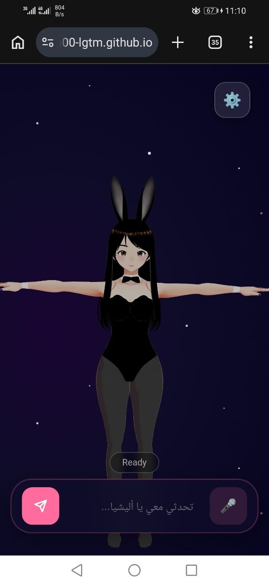

<div align="center">


# 🤖 Alisha AI

### Interactive Anime Avatar AI Agent with Multi-Provider Support

*Live2D & VRM Anime Avatar • Real AI Agent with 16 Tools • Multi-Language TTS & Voice Input • 4 AI Providers*

<br/>

[](https://magengillan00-lgtm.github.io/Alisha/)
[](https://Magen01-alisha-agent.hf.space)
[](LICENSE)
[](https://github.com/magengillan00-lgtm/Alisha/stargazers)

<br/>

> **Alisha** is a next-generation AI agent companion — combining live 2D/3D anime avatars with a real AI agent that can execute tasks using 16 tools, powered by 4 AI providers (HuggingFace, NVIDIA, Groq, Google Gemini). Full Arabic, Japanese, and English support.

</div>

---

## 🎭 Avatars

<div align="center">

### Live2D — 2D Animated

| | | |
|:---:|:---:|:---:|
| <br/>**Haru**<br/><sub>🌸 Pink hair • Casual dress</sub> | <br/>**Epsilon**<br/><sub>❄️ White short hair • Green eyes</sub> | <br/>**Kei**<br/><sub>🍀 Green hair • School uniform</sub> |
| <br/>**Tsumiki**<br/><sub>🎀 Black hair • White dress</sub> | <br/>**Chino** · 香風智乃<br/><sub>🐰 Long white hair • Blue uniform</sub> | |

### VRM — 3D Full Body

| |
|:---:|
| <br/>**Waifu 3D**<br/><sub>🐇 Bunny suit • Full body movements • Lip sync</sub> |

</div>

---

## ✨ Features

### 🤖 Real AI Agent (16 Tools)

When you send a task message (e.g., "ابحث عن...", "اكتب كود", "search for..."), Alisha activates **Agent Mode** and executes tasks step-by-step:

| Category | Tools | Description |
|----------|-------|-------------|
| 🔍 **Search & Web** | `web_search`, `fetch_webpage` | Search the web, fetch URL content |
| 💻 **Code & System** | `run_python`, `run_shell`, `system_info` | Execute code and commands |
| 📁 **File Operations** | `read_file`, `write_file`, `list_directory` | Read/write local files |
| 🐙 **GitHub** | `github_read_file`, `github_list_files`, `github_create_or_update_file`, `github_create_pr` | Full GitHub integration |
| 🧮 **Utilities** | `calculate`, `datetime_now`, `json_format`, `translate` | Math, time, translation |

### ⚡ Multi-Provider AI

| Provider | Model | Speed | Notes |
|----------|-------|-------|-------|
| **HuggingFace** | Qwen 2.5 72B | ⚡⚡⚡ | Default agent provider |
| **NVIDIA NIM** | Llama 3.1 405B | ⚡⚡⚡⚡ | Largest model |
| **Groq** | Llama 3.3 70B | ⚡⚡⚡⚡⚡ | Fastest inference |
| **Google Gemini** | 2.0 Flash | ⚡⚡⚡ | Multimodal |

**Smart Fallback:** If one provider fails, automatically tries the next one.

### 🌐 Multi-Language Support

| Language | Voice | Notes |
|----------|-------|-------|
| 🇸🇦 **Arabic** | Native TTS | Full Arabic responses |
| 🇺🇸 **English** | Native TTS | English-only responses |
| 🇯🇵 **Japanese** | Native TTS | 日本語完全対応 |

### 🎤 Voice Interaction

- **Microphone Input** — Voice-to-text with automatic language detection
- **Text-to-Speech** — Natural voice output with lip sync
- **Per-Language Voices** — Choose from available system voices

### 🎨 Visual Experience

- Live2D avatars with natural idle animations
- VRM 3D avatar with breathing, arm movements, eye tracking
- Lip sync synchronized with speech
- 3 anime backgrounds: Space 🌌 • Sakura Garden 🌸 • Room 🏠

### ⚙️ Three Modes

| Chat Mode | Agent Mode | Pro Mode |
|-----------|------------|----------|
| Normal conversation | Task execution with tools | Custom API keys |
| Quick responses | Step-by-step reasoning | Choose any model |
| 30s timeout | 120s timeout | Full control |
| Any provider | Alisha Agent backend | Direct API calls |

---

## 🚀 Getting Started

### Quick Start (No Setup Required)

1. Visit: **[magengillan00-lgtm.github.io/Alisha](https://magengillan00-lgtm.github.io/Alisha/)**
2. Select language, avatar, and background
3. Click "Start" and begin chatting!

### Agent Mode (Execute Tasks)

1. Open **Settings** (⚙️) → Select **Alisha Agent** as provider
2. Send a message with a task keyword: `ابحث`, `نفذ`, `اكتب كود`, `search`, `execute`, etc.
3. Alisha will execute the task step-by-step using available tools
4. Results shown with steps breakdown

### Run Agent Backend Locally

```bash
cd agent/
pip install -r requirements.txt

# Set API keys
export HF_TOKEN="hf_..."
export NVIDIA_API_KEY="nvapi-..."
export GROQ_API_KEY="gsk_..."
export GOOGLE_API_KEY="AIzaSy..."

python app.py  # Runs on http://localhost:7860
```

### Deploy to HuggingFace Space

1. Create a new Space on [huggingface.co/new-space](https://huggingface.co/new-space) with **Docker** SDK
2. Upload files from `agent/` folder
3. Add API keys as Space Secrets (Settings → Repository secrets):
   - `HF_TOKEN`, `NVIDIA_API_KEY`, `GROQ_API_KEY`, `GOOGLE_API_KEY`, `GITHUB_TOKEN`
4. Update the agent URL in Settings → Agent Backend URL

### Pro Mode (Custom API)

1. Open **Settings** (⚙️)
2. Scroll to **🔧 Pro Mode** at bottom
3. Enter your API key (Groq/HuggingFace/NVIDIA/OpenRouter)
4. Click **Verify** — real models will load
5. Select your preferred model
6. Click **Save**

---

## 🏗️ Architecture

```
┌─────────────────────────────────────────────┐
│              User Browser                   │
│         GitHub Pages — index.html           │
└───────┬─────────────────────────┬───────────┘
        │ Chat Mode               │ Agent Mode
        │ (Direct API)            │ (Task Keywords)
        ▼                         ▼
┌───────────────┐     ┌─────────────────────────┐
│ Direct Calls  │     │    Alisha Agent Backend  │
│ (Browser API) │     │     (HuggingFace Space)  │
└───┬───┬───┬───┘     │   FastAPI + Gradio       │
    │   │   │         │   16 Tools • ReAct Loop   │
    ▼   ▼   ▼         └──┬───┬───┬───┬───────────┘
  Groq NVIDIA Gemini     │   │   │   │
                         ▼   ▼   ▼   ▼
                        HF NVIDIA Groq Google
                      (Backend Provider Selection)
```

---

## 🛠️ Tech Stack

| Technology | Version | Purpose |
|------------|---------|---------|
| **Three.js** | 0.177 | 3D VRM rendering |
| **@pixiv/three-vrm** | 3.x | VRM avatar support |
| **PIXI.js** | 6.5 | 2D Live2D rendering |
| **pixi-live2d-display** | 0.4 | Cubism 4 engine |
| **Web Speech API** | Native | TTS + STT |
| **FastAPI** | Latest | Agent backend API |
| **Gradio** | 5.x | Agent web UI |
| **Python** | 3.12 | Agent runtime |
| **HuggingFace Hub** | Latest | AI inference |
| **NVIDIA NIM** | Latest | Llama 3.1 405B |
| **Groq API** | Latest | Llama 3.3 70B |
| **Google Gemini** | 2.0 Flash | Multimodal AI |

---

## 📁 Project Structure

```
Alisha/
├── index.html                      # Frontend application
├── README.md                       # This file
├── memory.json                     # Conversation memory
├── agent/                          # Agent backend
│   ├── app.py                      # FastAPI + Gradio agent (16 tools)
│   ├── requirements.txt            # Python dependencies
│   ├── Dockerfile                  # Docker deployment
│   ├── README.md                   # Agent documentation
│   └── .env.example                # API keys template
├── .github/
│   └── workflows/
│       └── deploy.yml              # CI/CD with secret injection
├── assets/
│   ├── models/
│   │   ├── 2d/                     # Live2D models
│   │   │   ├── kei_vowels_pro/
│   │   │   ├── Epsilon_free/
│   │   │   ├── haru/
│   │   │   ├── tsumiki/
│   │   │   └── chino/
│   │   ├── 3d/                     # VRM models
│   │   │   ├── waifu.vrm
│   │   │   └── backgrounds/
│   ├── previews/                   # Avatar screenshots
│   └── audio/
```

---

## 🔐 Security & API Keys

- **API keys stored as Secrets** — Never exposed in source code
- **HuggingFace Space Secrets** for agent backend keys
- **No conversation data** stored on external servers
- **LocalStorage only** for user preferences

### How to Add API Keys

1. Go to your [HuggingFace Space Settings](https://huggingface.co/spaces/Magen01/Alisha-Agent/settings)
2. Scroll to **Repository secrets**
3. Add these keys:

| Secret Name | Provider | How to Get |
|-------------|----------|------------|
| `HF_TOKEN` | HuggingFace | [hf.co/settings/tokens](https://huggingface.co/settings/tokens) |
| `NVIDIA_API_KEY` | NVIDIA NIM | [build.nvidia.com](https://build.nvidia.com) |
| `GROQ_API_KEY` | Groq | [console.groq.com/keys](https://console.groq.com/keys) |
| `GOOGLE_API_KEY` | Google Gemini | [aistudio.google.com/apikey](https://aistudio.google.com/app/apikey) |
| `GITHUB_TOKEN` | GitHub | [github.com/settings/tokens](https://github.com/settings/tokens) (optional) |

---

## 🎯 Keyboard Shortcuts

| Key | Action |
|-----|--------|
| 🎤 Click bottom button | Voice input (default) |
| 💬 Click top button | Toggle text chat |
| 🎤 In chat mode | Start voice recording |

---

## 📋 Changelog

### v3.0.0 — Agent Mode
- Real AI agent with 16 tools (search, code, GitHub, files, etc.)
- Multi-provider support: HuggingFace, NVIDIA NIM, Groq, Google Gemini
- Agent mode auto-detection via task keywords
- Secrets management UI with provider health status
- Agent backend configurable URL
- ReAct reasoning pattern with step-by-step execution

### v2.2.0 — Pro Mode
- Add custom API keys in Settings
- Fetch real available models per provider

### v2.0.0 — Multi-Provider
- Groq + Gemini + KiloClaw
- Provider switching
- Model selection

---

<div align="center">

### 🧑‍💻 Developer

**Magen Gillan** (ميجن غيلان) — The Red King

---

### 📄 License

**MIT** — Free for personal and commercial use

---

### ⭐ Show Your Support

If you like Alisha, give it a star on GitHub!

[](https://github.com/magengillan00-lgtm/Alisha)

---

*Built with ❤️ by Magen Gillan*

**Version:** `v3.0.0` — Agent Mode &nbsp;|&nbsp; **Last Updated:** 2026-04-24

</div>